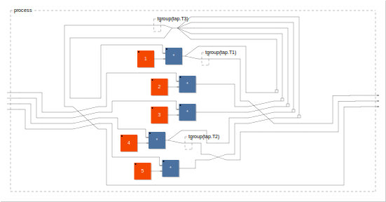
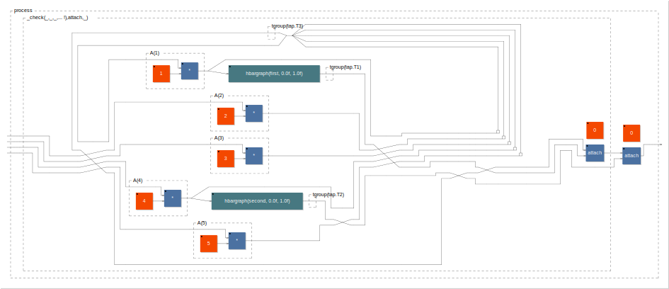
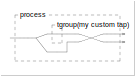
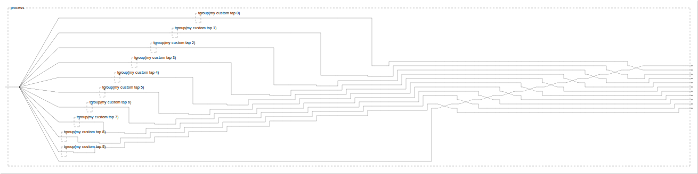

# Faust Tap Library

Tap a complicated expression to pull out specific outputs, without having to manually route those outputs, just like how named function parameters remove the need to manually route inputs.

#### `tap.extract` usage

```faust
tap = library("tap.lib");

A(k) = *(k);

complicatedExpression = _,_,_,_ : (
        (A(1) <: _,tap.T1),
         A(2),
         A(3),
        (A(4) <: _,tap.T2),
         A(5)
    ) ~ (_,_,_,_,_ :> _ <: _,tap.T3)
      : si.block(5)
      ;
process = tap.extract(complicatedExpression, (tap.T1, tap.T2, tap.T3));
```
Each tap.T1, tap.T2, etc functions as a named !, i.e. has one input and zero outputs. When an expression is wrapped with tap.extract, the inputs to the T's get routed to the outputs of the expression (after any existing outputs).

In the above example, `complicatedExpression` has four inputs and zero outputs. Extracting the three taps (tap.T1, tap.T2, tap.T3) means that `process` will have four inputs and three outputs (in the same order as the second argument to tap.extract).

<details><summary>Block diagram</summary>



</details>

#### `tap.persist` usage

Like `tap.extract`, except it merely ensures that the taps get computed rather
than routing them to the output. It's useful for persisting hbargraph/vbargraph
without manually routing to an output and then calling `attach`. The
implementation is just `extract` followed by `attach`, so it's required that
the first argument to `persist` have at least one output (so that `attach` has
something to work with).

```faust
tap = library("tap.lib");

A(k) = *(k);

complicatedExpression = _,_,_,_ : (
        (A(1) <: _,(hbargraph("first", 0, 1) : tap.T1)),
         A(2),
         A(3),
        (A(4) <: _,(hbargraph("second", 0, 1) : tap.T2)),
         A(5)
    ) ~ (_,_,_,_,_ :> _ <: _,tap.T3)
      : si.block(5)
      ;
process = tap.persist(
    tap.extract(complicatedExpression, tap.T3),
    (tap.T1, tap.T2)
);
```

<details><summary>Block diagram</summary>



</details>

#### Named taps

There are pre-defined taps `tap.T1`, ..., `tap.T9`. If you need more than that in a single `tap.extract` call, you can define your own with `tap.namedTap`, though you need to carefully follow the required syntax:

```faust
tap = library("tap.lib");

myTap = tap.namedTap(tgroup("my custom tap", _));

process = tap.extract(
    (_ <: myTap, _)
, myTap);
```

<details><summary>Block diagram</summary>



</details>

```faust
tap = library("tap.lib");

myTaps = par(i, 10, tap.namedTap(tgroup("my custom tap %i", _)));

process = tap.extract(
    (_ <: myTaps, _)
, myTaps);
```

<details><summary>Block diagram</summary>



</details>

#### Limitations

Each tap can only take a single wire input, i.e. does not handle a bus of more than one signal. You can use `par` to create a parallel bus of taps, though, see the example above.

Some kinds of Faust expressions can't be extracted through. Functions with parameters are opaque to tap.extract, and likewise hgroup/vgroup/tgroup, so the following don't work:

```faust
A(x, y, z) = x + y + z : tap.T1;
process = tap.extract(A, tap.T1); // Doesn't work

process = tap.extract(
    hgroup("foo", (hslider("bar", 0, 0, 1, 1) : tap.T1)),
    tap.T1
); // Doesn't work
```

But these workarounds do:

```faust
// Move tap.extract inside the function definition:
A(x, y, z) = tap.extract((x + y + z : tap.T1), tap.T1);
process = A; // works

// Use the group name in the UI input name
process = tap.extract(
    (hslider("h:foo/bar", 0, 0, 1, 1) : tap.T1),
    tap.T1
); // works
```

#### Block diagram

The resulting block diagram can potentially be quite visually messy, so when developing, consider developing the expression without the final `tap.extract` and then include it only once you have the rest working.
